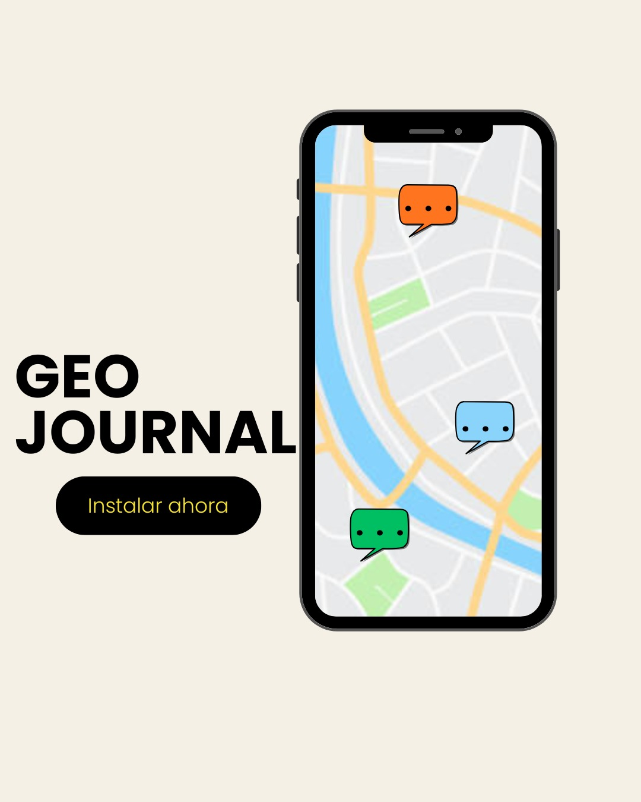
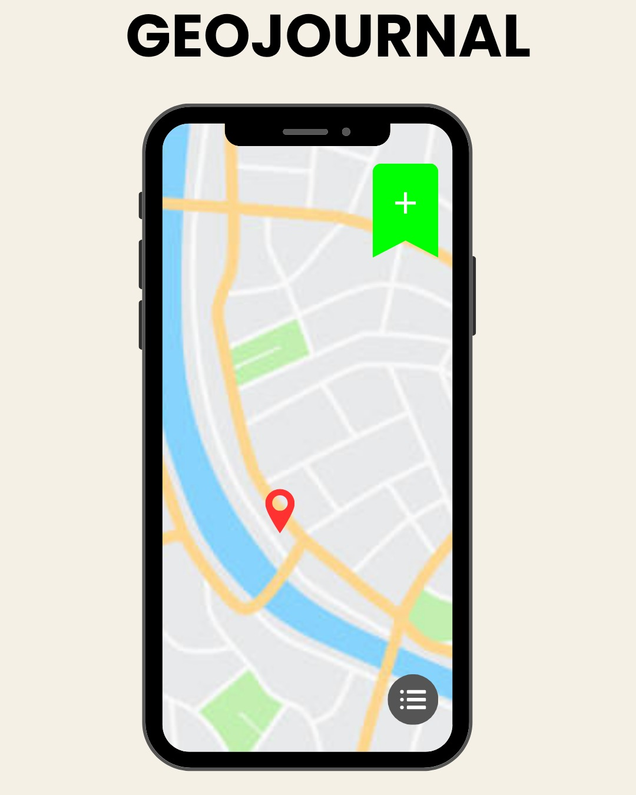
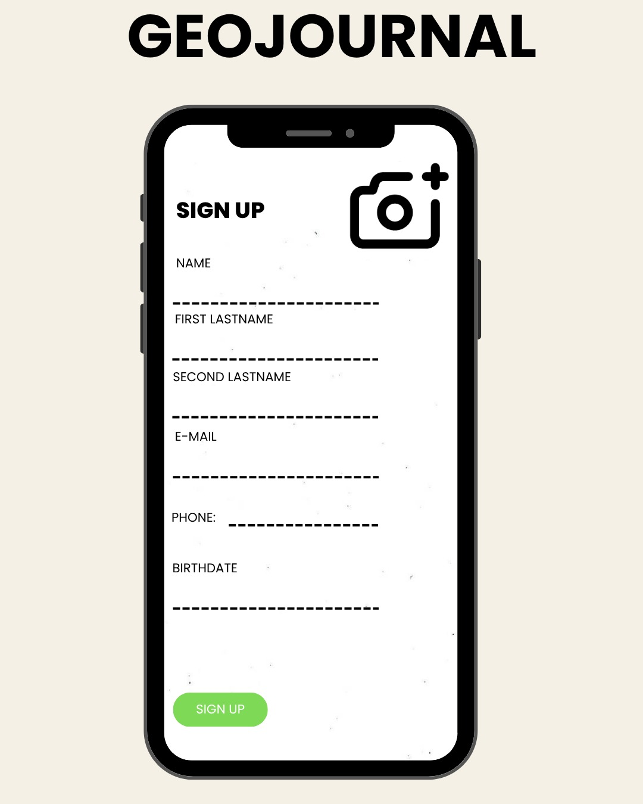
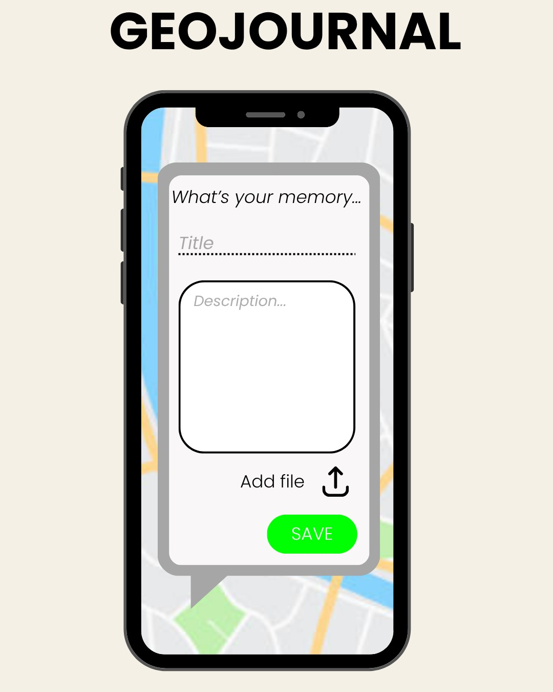

# ProyectoMoviles
## GeoJuouGeoJournal: Capture Your World, One Place at a Time

Imagine having a personal map that not only shows where you've been but also tells the story of your journey with rich media and detailed notes. GeoJournal is an innovative app that allows you to capture and document your experiences at specific locations, turning your memories into interactive, multimedia-rich entries.

Whether you’re a traveler, a photographer, a geocacher, or just someone who loves exploring, GeoJournal lets you:

* Leave a Digital Footprint: Mark any place with custom notes, photos, or videos. Every memory is tied to a location on the map.

* Add Media in Any Form: Capture your surroundings instantly by taking photos, recording videos, or writing text notes—no more searching for that lost receipt or remembering exactly where something happened.

* Explore Your Own Journey: Review your journey with a map-based timeline of all your notes, marks, and media, whether you’re reliving past travels or exploring the places around you.

* Create Rich, Visual Memories: Instead of simple notes, each mark becomes a multimedia experience that brings the memory to life. Think of it as a digital scrapbook that’s both interactive and immersive.

 

